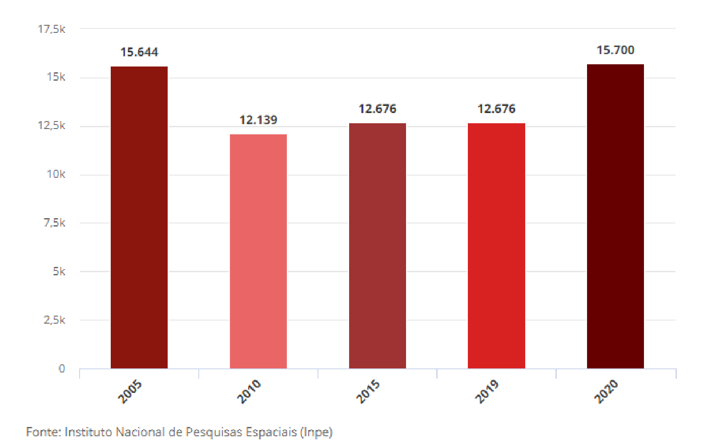

# Forest Fire (Linear Regression an Randome Forest)
**GOAL:** make predictions of forest fires in areas of the Amazon region using data from INPE ans INMET, so that the responsable authorities can act proactively, preventing an enviromental disaster.

# Intro
Data reveals an increase in fire outbreaks in the Amazon Rainforest at the beggining of the 21st century, particularly in 2005. However, there was a slight decline in the following years, followed by a significant rise in 2020.

## Methods & Matirials
**Important Variables:** "diasemchuva" (days without rain), "precipitacac" (precipitacion), "Temp. Max" (maximum temperature), "frp" (radiation index)

**Linear Regression:** in order to predict the fire risk based on the data entered by a user into our model, using the calculation of an equation derived from the regression model.

**Randome Forest:** to ensure the ability to observe the main variables that impact the regression model and to assess the actual influence of these variables on the fire risk.
